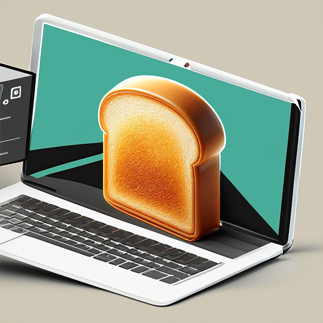

# Toast Blog HQ

We like toast. It's the best thing since sliced bread.

## Table of Contents
- [Getting Started](#🚀-getting-started)
- [Features](#📝-features)
- [Preview](#📷-preview)
- [Demo](#🌐-live-demo)
- [License](#📄-license)
- [Contact Me](#📧-contact-me)

## 🚀 Getting Started
Just stick your plain bread into the toaster and pull the lever.

## 📝 Features
- Bread is crunchy.
- It's good for spreading butter onto.
- Also good with eggs/avocado.

## 📷 Preview

## 🌐 Live Demo
https://github.com/Index-al/Toast-HQ

## 📄 License
This project is covered under the MIT license.

## 📧 Contact Me
For any questions, please contact me at [DanTCathey@gmail.com](mailto:DanTCathey@gmail.com).
Find more of my work at [Index-al](https://github.com/Index-al).
