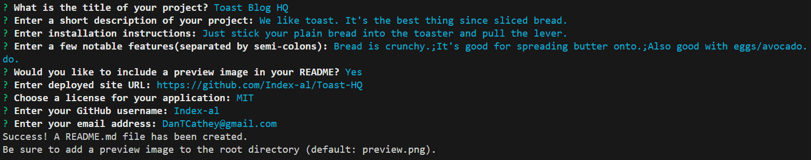

# 🌟 README Generator

This project is a Node.js application designed to simplify the creation of README files. It leverages the `inquirer` package to prompt users for their project details, and then it neatly formats these into a well-structured README.md file.

## 🚀 Getting Started

To kickstart this project, follow these steps:

1. Clone the repo:
   ```bash
   git clone [Your Repository Link Here]
   cd [Your Repository Name]
   ```

2. Install the dependencies (specifically `inquirer` version 8.2.4, as newer versions are not compatible with this code):
   ```bash
   npm install inquirer@8.2.4
   ```

## 💻 Usage

Ready to generate your README? Just run:

```bash
node index.js
```

Follow the prompts to input your project details. After you complete the questions, a shiny new README.md file will be generated in the current directory!


## 📷 Preview


## 👥 Contributing

Interested in contributing? Awesome! 🌟

1. Fork the repository.
2. Create a new branch for your feature or fix.
3. Make your changes.
4. Submit a pull request.

This is a one-off little thing so you may have to contact me directly to get your changes merged in.

## ❓ Questions

Got questions?
Feel free to open an issue or contact me directly [here](mailto:DanTCathey@gmail). View more of my work on my [GitHub page](https://github.com/Index-al).
